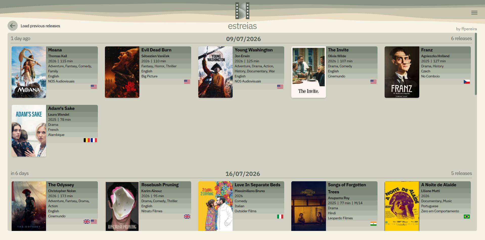
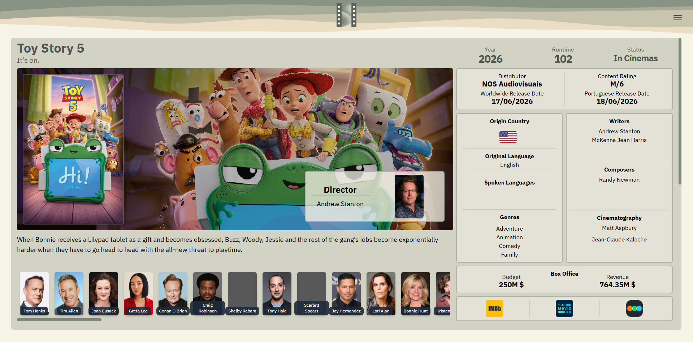
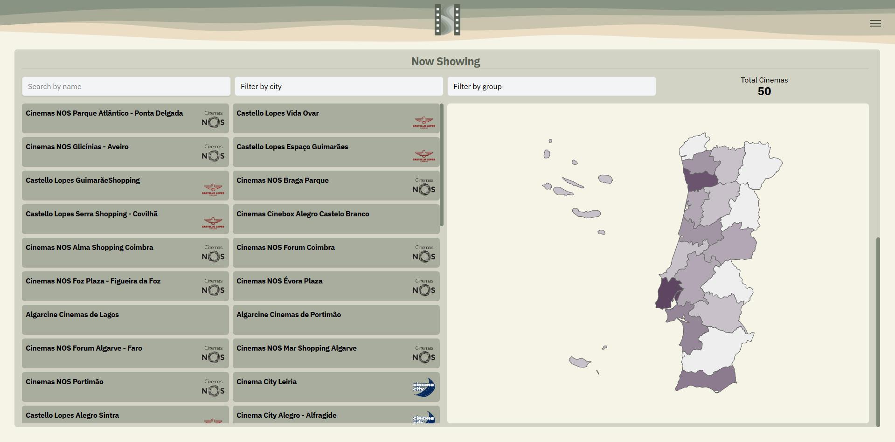
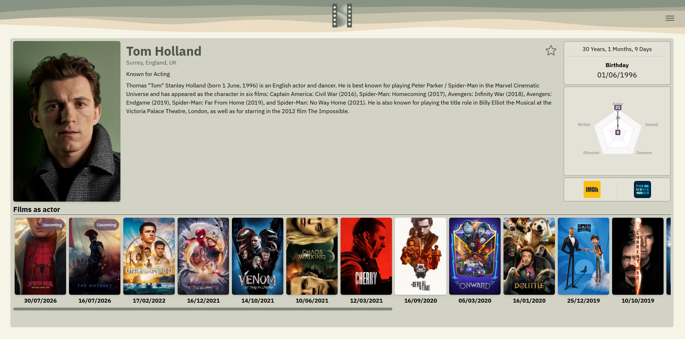
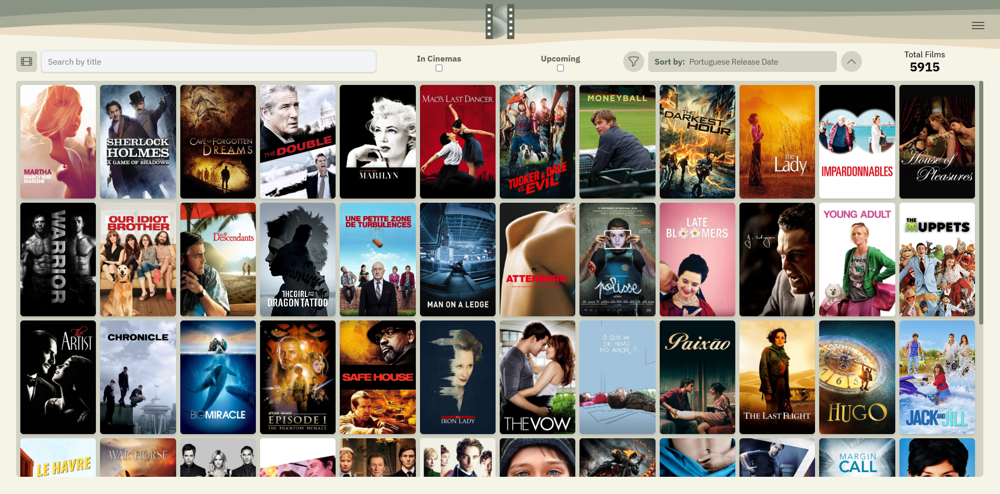
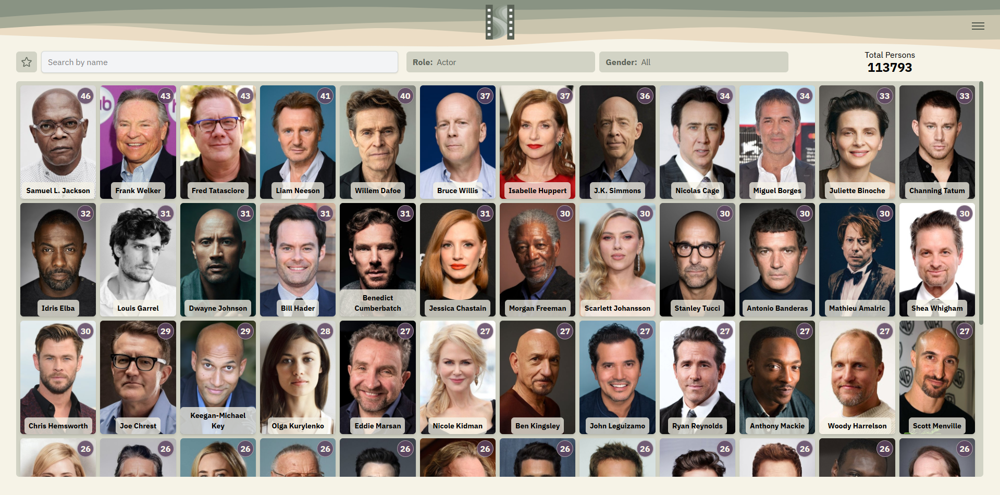
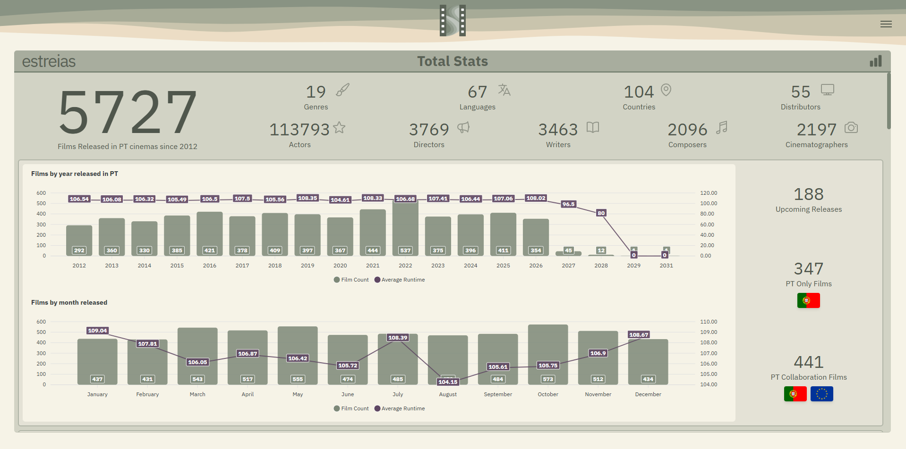
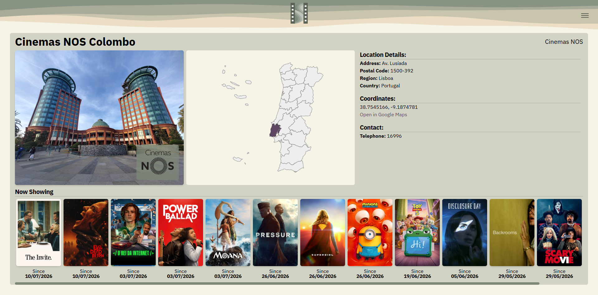

# Estreias

https://estreias.ffpereira.com/

**Estreias** is a **full-stack personal project** that tracks and presents film releases in Portuguese cinemas, including upcoming and past titles, cinema screenings across the country, and aggregated insights on the individuals most frequently involved in released productions.

This project is **strictly non-commercial**, developed in accordance with best practices for data privacy and responsible usage, and intended solely for research and educational purposes. The author disclaims any liability for errors, omissions, or inaccuracies in the data presented.

---

---

## Features

- Full-stack implementation: Python backend + React frontend  
- Daily automated data collection and updates  
- Interactive charts for releases, films and persons statistics  
- User-friendly interface to explore film releases in Portuguese cinemas
- Easy visualization of all screenings in every Portuguese district
- Integration with TMDB API for data collection
- Archival of all releases since 2011
- Filtering by genres, countries, distributors and much more
- API documentation available at `/api/docs`

---

## Technology Stack

**Backend:**

- Python 3.12
- Flask for REST API  
- PostgreSQL database with ORM via `Flask-Alchemical`  
- Marshmallow for data serialization  
- API Fairy for automatic API documentation  
- Pytest for testing  
- Cron jobs for scheduled data updates (`data.py`, `update_persons.py`)  

**Frontend:**

- React 19.1 (via Vite)  
- TailwindCSS 4.1 for responsive design  
- GSAP 3.13 for animations  
- ApexCharts 1.7 for interactive charts  

---

## Pages

### Home Page
Displays the release calendar for films in Portuguese cinemas. The calendar starts from the current date and shows both current and past releases, with the option to load additional previous or upcoming releases.

Each film entry includes key information such as title, runtime, director, genres, language, distributor, and production countries.

 

### Film Page
Provides a detailed view of a film, including:
- Title, tagline, description, year, runtime, distributor, release date, cast, crew, origin countries, languages, genres and box office information
- Links to the film's IMDb, TMDB and Letterboxd pages  

  

If the film is currently showing in Portuguese cinemas, the page also includes an interactive map displaying the cinemas where it is available.

### Person Page
Displays information about a person:
- Name, place of birth, birthday, and description
- Links to the persons's IMDb and TMDB pages  

The films that the person is involved appear in descending Portuguese release date order.

### Films Page
Lists all films that have been released in Portuguese cinemas or have a scheduled future release date. Features include:
- Search by title
- Sort by release date, runtime, title, budget, and revenue
- Filter by in cinemas, upcoming, genres, countries, distributors, and content rating 

### Persons Page
Lists all people who have been involved in one or more films with a Portuguese release date as an actor, director, writer, composer, and/or cinematographer. People are ordered by the total number of associated films, in descending order.
- Search by name
- Filter by role and gender

### Stats Page
Provides comprehensive statistics and visualizations for the selected category, including overall statistics, countries, runtimes, release years, languages, distributors, content ratings, genres, and more.

Features include:
- Detailed statistics and summary metrics
- Interactive world map with country-based data
- Interactive charts for exploring distributions and trends

### Cinema Page
Displays information about a Portuguese cinema, including its location, contact details, and cinema group.

Also lists the films currently showing at the cinema, ordered by Portuguese release date (most recent first).

---

## License

This project is licensed under the [MIT License](LICENSE).

---

## Acknowledgements

This project's structure was inspired by Miguel Grinberg's excellent tutorial: [React Mega-Tutorial](https://blog.miguelgrinberg.com/post/introducing-the-react-mega-tutorial)

---

## Contact

For questions or feedback, you can reach me at: [estreias@ffpereira.com](mailto:estreias@ffpereira.com)